# Add implement-opencode workflow

## Overview

Create a new workflow `@fabro/workflows/implement-opencode/` that is a variant of the existing `implement` workflow but uses the `opencode acp` agent instead of the built-in API backend.

## Problem Statement / Motivation

We recently added support for ACP (Agent Client Protocol) agents in Fabro. To demonstrate and utilize this capability, we need a version of our standard `implement` workflow that delegates the implementation and simplification steps to an external `opencode acp` agent.

## Proposed Solution

1. Duplicate the existing `fabro/workflows/implement/` directory to `fabro/workflows/implement-opencode/`.
2. Update the `workflow.fabro` graph to use the `acp` backend instead of the `api` backend.
3. Configure the ACP command in `workflow.toml` to use `opencode acp`.

## Technical Considerations

- **Backend Configuration**: The `model_stylesheet` in `workflow.fabro` needs to be updated to set `backend: acp;` instead of `backend: api;`.
- **ACP Command**: The `workflow.toml` needs to specify the ACP command to run, which is `opencode acp`.
- **Setup Commands**: If `opencode` is not installed in the default sandbox, we might need to add a setup command to install it, or assume it's available in the environment.

## Acceptance Criteria

- [x] `fabro/workflows/implement-opencode/workflow.fabro` is created based on `implement/workflow.fabro`.
- [x] `fabro/workflows/implement-opencode/workflow.toml` is created and configures the `opencode acp` command.
- [x] The `model_stylesheet` in `workflow.fabro` uses `backend: acp;`.
- [x] The workflow successfully runs the `opencode acp` agent for the prompt nodes.

## MVP

### fabro/workflows/implement-opencode/workflow.toml

```toml
version = 1

[acp]
command = "opencode acp"
```

### fabro/workflows/implement-opencode/workflow.fabro

```dot
digraph ImplementOpencode {
    graph [
        goal="Implement and simplify using opencode acp",
        model_stylesheet="
            * { backend: acp; }
        "
    ]
    rankdir=LR

    start [shape=Mdiamond, label="Start"]
    exit  [shape=Msquare, label="Exit"]

    toolchain         [label="Toolchain", shape=parallelogram, script="command -v cargo >/dev/null || { curl --proto '=https' --tlsv1.2 -sSf https://sh.rustup.rs | sh -s -- -y && sudo ln -sf $HOME/.cargo/bin/* /usr/local/bin/; }; cargo --version 2>&1", max_retries=0]
    preflight_compile [label="Preflight Compile", shape=parallelogram, script="cargo check -q --workspace 2>&1", max_retries=0]
    preflight_lint    [label="Preflight Lint", shape=parallelogram, script="cargo clippy -q --workspace -- -D warnings 2>&1", max_retries=0]
    fix_lints         [label="Fix Lints", prompt="The preflight lint step failed. Read the build output from context and fix all clippy lint warnings.", max_visits=3]
    implement         [label="Implement", prompt="Read the plan file referenced in the goal and implement every step. Make all the code changes described in the plan. Use red/green TDD."]
    simplify          [label="Simplify", prompt="@prompts/simplify.md"]
    verify            [label="Verify", shape=parallelogram, script="cargo clippy -q --workspace -- -D warnings 2>&1 && cargo nextest run --cargo-quiet --workspace --status-level fail 2>&1", goal_gate=true, retry_target="fixup"]
    fixup             [label="Fixup", prompt="The verify step failed. Read the build output from context and fix all clippy lint warnings and test failures.", max_visits=3]
    fmt               [label="Format", shape=parallelogram, script="cargo fmt --all 2>&1", goal_gate=true, max_retries=0]

    start -> toolchain
    toolchain -> preflight_compile [condition="outcome=success"]
    toolchain -> exit
    preflight_compile -> preflight_lint [condition="outcome=success"]
    preflight_compile -> exit
    preflight_lint -> implement [condition="outcome=success"]
    preflight_lint -> fix_lints
    fix_lints -> preflight_lint
    implement -> simplify -> verify
    verify -> fmt   [condition="outcome=success"]
    verify -> fixup
    fixup -> verify
    fmt -> exit
}
```



## Sources

- Related documentation: `docs/core-concepts/agents.mdx`
