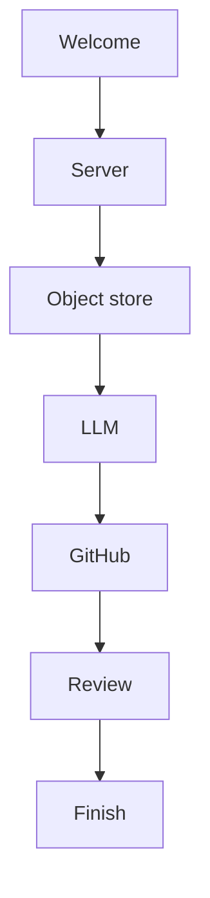
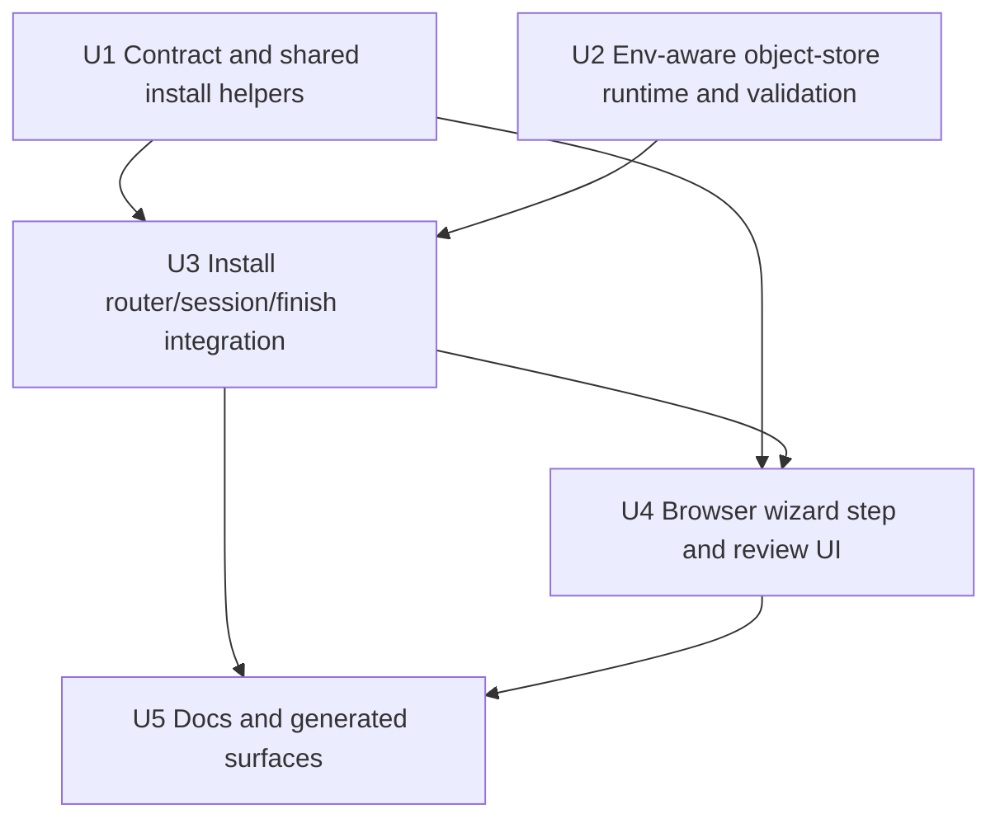

# feat: Add object-store step to the browser install wizard

## Overview

Add a first-run `Object store` step to the browser install wizard between `Server` and `LLM`. The step lets the operator choose one shared object-store mode for both SlateDB and artifacts: `Local disk` or `AWS S3`. The S3 path collects `bucket`, `region`, and one of two credential modes: runtime credentials (deployment-provided AWS auth such as ECS/EKS/IRSA metadata flows, instance profiles, or AWS env vars already present in the server process) or manually-entered `AWS_ACCESS_KEY_ID` / `AWS_SECRET_ACCESS_KEY`.

> **Terminology.** This plan uses **runtime credentials** to refer to the deployment-provided AWS auth path (what the UI labels `Use AWS runtime credentials`). Earlier drafts called this "ambient", "ambient runtime", or "default chain"; those were shorthand for "credentials supplied by the runtime rather than typed into the wizard". **Manual credentials** refers to the static access-key-pair path.

The implementation is broader than a UI form. It touches the install API contract, server-side install session state, settings/env persistence, the browser wizard flow, and the server's runtime object-store initialization. The key technical requirement is that manual AWS credentials stored in `server.env` must actually be consumed by the S3 object-store builder at install-finish time and on subsequent server boots.

The wizard's goal is that `POST /install/finish` produces a fully bootable server with no subsequent operator env-editing step. A UI-only variant that writes `settings.toml` but requires the operator to separately place `AWS_*` into process env or `server.env` defeats that goal — it leaves the wizard claiming completion without persisting the secrets it just collected, and turns the "type keys into the wizard" affordance into a trap. That UX goal is what keeps Unit 2's runtime bridge load-bearing; the existing `process env -> server.env` precedence in `server_secrets.rs` is the precedence mechanism we reuse, not a standalone architectural invariant.

## Problem Frame

The browser install flow currently covers canonical URL, LLM credentials, and GitHub, but it does not expose the existing object-store configuration surface that already exists in server settings. Operators who want S3-backed SlateDB/artifact storage have to finish the wizard and then hand-edit `settings.toml` plus startup secrets.

That defeats the point of a remote-first web install flow. The object-store choice belongs in the install wizard because it is foundational server infrastructure, not an advanced follow-up tweak. The plan keeps the local storage root model unchanged: `server.storage.root` remains host-local storage, while the new step chooses only the shared object store used by `server.slatedb` and `server.artifacts` (see origin: `docs/brainstorms/2026-04-22-web-install-object-store-choice-requirements.md`).

## Requirements Trace

### Wizard placement and step ordering (R1-R3)

- Add a first-class `Object store` wizard step after `Server` and before `LLM`, and make the UI copy explicit that the local host storage root still exists and this step only chooses the shared object store.

### Storage mode and scope (R4-R9)

- Offer exactly two wizard-managed modes: `Local disk` and `AWS S3`. The choice applies to both `server.slatedb` and `server.artifacts`. The S3 path uses one shared bucket with fixed prefixes `slatedb` and `artifacts` in config, which correspond to `slatedb/` and `artifacts/` keys in the bucket at runtime. No split backends, custom prefixes, endpoint, or path-style options are exposed in the wizard.

### Credential collection and persistence (R10-R15)

- The S3 path collects `bucket`, `region`, and one of two credential modes: runtime credentials or manual access-key credentials. Manual mode collects only `AWS_ACCESS_KEY_ID` and `AWS_SECRET_ACCESS_KEY`, persists them as server-only startup secrets, and explicitly excludes STS/session-token inputs.

### Validation and session handling (R16-R18)

- S3 configuration is live-validated before the wizard advances. Validation errors render inline and should distinguish shape errors from access failures where practical. The review/session surfaces summarize the chosen object-store mode without echoing secret values.

### Review display (R19)

- The review step shows the chosen mode, and for S3 shows bucket, region, credential mode, and the fixed `slatedb` / `artifacts` prefixes.

## Scope Boundaries

- No changes to the terminal `fabro install` flow in this pass.
- No attempt to make `server.storage.root` remote or optional. Host-local storage remains required.
- No support for separate object-store backends for SlateDB and artifacts.
- No S3-compatible endpoint/path-style options in the wizard.
- No STS/session-token/manual-profile flows.
- No SlateDB tuning changes such as `disk_cache` defaults; existing defaults remain in force.
- No generic install-wizard refactor from the current monolithic `install-app.tsx` into route-local files unless a small local helper extraction is needed to keep the patch readable.

## Context & Research

### Relevant Code and Patterns

- **Install API contract:** `docs/api-reference/fabro-api.yaml` currently exposes install session, LLM, server, GitHub, and finish endpoints. `InstallSessionResponse` has `llm`, `server`, `github`, and `prefill`, but no storage/object-store field.
- **Browser install client:** `apps/fabro-web/app/install-api.ts` is a thin raw-fetch wrapper over the install routes. It already follows the pattern `POST /test` then `PUT /step` for LLM and GitHub token validation.
- **Browser install UI:** `apps/fabro-web/app/install-app.tsx` is the install wizard host. Step order, current-step routing, back/next links, session hydration, and review summary are all hard-coded there today.
- **Server install session/router:** `lib/crates/fabro-server/src/install.rs` owns `PendingInstall`, the per-step DTOs, the `/install/*` handlers, `completed_steps`, and the `post_install_finish` persistence path.
- **Shared install persistence:** `lib/crates/fabro-install/src/lib.rs` already centralizes pure install-time settings mutation (`merge_server_settings`, `write_token_settings`, `write_github_app_settings`) and direct persistence (`persist_install_outputs_direct`).
- **Runtime object-store wiring:** `lib/crates/fabro-server/src/serve.rs` builds local/S3 object stores from resolved settings. The current S3 path uses `AmazonS3Builder::from_env()` directly, so it sees process env but does not currently consult `server.env`.
- **Server secret precedence:** `lib/crates/fabro-server/src/server_secrets.rs` already defines the server runtime precedence model as `process env -> server.env`. `docs/administration/server-configuration.mdx` documents the same rule.
- **Install router tests:** `lib/crates/fabro-server/tests/it/api/install.rs` covers install session/auth, finish semantics, and artifact metadata creation. `apps/fabro-web/app/install-app.test.tsx` already exercises wizard rehydration and GitHub callback flows.

### Existing Patterns to Reuse

- **Separate validation and persistence endpoints:** `POST /install/llm/test` and `POST /install/github/token/test` validate external credentials without mutating session state; `PUT /install/llm` and `PUT /install/github/token` persist only after client-side success.
- **Redacted session snapshots:** `install.rs` stores raw secrets in memory but exposes only redacted summaries through `GET /install/session`. The LLM and GitHub flows already prove the pattern for "configured but not rehydrated" secret inputs.
- **Shared settings helpers:** `fabro-install` is already the right place for pure config/env mutation helpers used by both CLI/server install surfaces.
- **Server-env precedence tests:** `lib/crates/fabro-server/src/server.rs` already has coverage proving process env wins over `server.env`.

### External References

- `object_store::aws::AmazonS3Builder` supports `new()`, explicit access-key setters, and explicit env-driven credential-provider inputs. That is the right primitive for preserving AWS role-based runtime auth while avoiding accidental leakage from unrelated `AWS_*` process env settings such as endpoint overrides.
- `object_store` list operations are a good fit for install-time validation because they exercise the real bucket/prefix access path without writing metadata during the wizard.

### Institutional Learnings

- No `docs/solutions/` entry currently covers object-store-backed install flows or S3 credential bridging. This is net-new planning ground.

## Key Technical Decisions

- **Use a dedicated object-store install contract.** Add a new install step and API shape instead of overloading `InstallServerConfigInput`. The server session response gets a separate redacted `object_store` summary field so the review screen and re-entry flow do not have to infer object-store state from raw settings text.
- **Use `object_store` as the session/completion token, and `/install/object-store` as the route.** The user-facing label stays `Object store`, while the route stays readable and the completed-step token matches current string-based step handling.
- **Keep `Local disk` as a settings no-op.** For the local path, do not write new `[server.slatedb]` / `[server.artifacts]` sections just to restate current defaults. `post_install_finish` already rebuilds `settings.toml` from a fresh TOML document on every run, so selecting `Local disk` naturally drops previously-written S3 sections without needing subtractive settings edits. The session/review surfaces still record the operator's choice during the wizard.
- **Write explicit S3 config only when S3 is selected.** The S3 path writes `[server.artifacts] provider = "s3"`, `prefix = "artifacts"`, `[server.artifacts.s3] bucket/region`, and the analogous `[server.slatedb]` config with `prefix = "slatedb"`. Prefix values are stored without trailing slashes because artifact paths are joined by `ArtifactStore::prefixed_raw()` in `lib/crates/fabro-store/src/artifact_store.rs`, while SlateDB base prefixes are normalized by `normalize_base_prefix()` in `lib/crates/fabro-store/src/slate/mod.rs`.
- **Extend `fabro-install` instead of hand-building new TOML in `install.rs`.** Add pure helper(s) in `lib/crates/fabro-install/src/lib.rs` for object-store settings mutation and server-env edits so the server install code stays declarative and future CLI parity has a reusable base.
- **Support both env sets and env removals during direct install persistence, scoped to wizard-managed keys.** This feature needs explicit removal support for `AWS_ACCESS_KEY_ID` and `AWS_SECRET_ACCESS_KEY` when the operator switches away from manual-credential mode. However, `server.env` may contain AWS keys the operator set for reasons unrelated to Fabro's object store (workflow-level tools, other integrations). Removal must be scoped to keys the wizard itself placed: wizard-written env lines carry a marker comment (for example, `# managed by fabro-install: object-store`) and the removal path only deletes keys that still carry that marker. Keys in `server.env` without the marker survive untouched, even when the current wizard mode would not write them.
- **Keep `server.env` persistence convergent on retry, not atomic at the install-flow level, but atomic at the filesystem level.** `server.env` mutations are applied immediately and persist even if later settings/vault writes fail. This plan does not widen scope into changing that broader install behavior. The new AWS-key removal path should follow the same model: retries must converge the file to the newly chosen state, and tests should make that lifecycle explicit. Each individual write must be atomic at the filesystem level — `envfile::merge_env_file` should write to a sibling tempfile in the same directory, `fchmod` it to `0600`, `fsync`, `rename(2)` it into place, and `fsync` the parent directory, so readers never observe a truncated or partial-credentials file.
- **Make the runtime object-store builder env-aware without inheriting unrelated `AWS_*` process env.** Refactor the S3 builder path to start from `AmazonS3Builder::new()`, apply bucket/region/path-style/endpoint from resolved settings, and feed credential-related lookup values through the existing `process env -> server.env` precedence model. Reuse `ServerSecrets::{with_env_lookup,get}` rather than introducing a second precedence system; `server_secrets.rs` should only change if a tiny helper extraction is needed for readability.
- **Allow only the credential-provider env inputs the runtime actually needs.** The env-aware builder should explicitly map the supported static-key, web-identity, container-credential, and metadata-provider inputs that `object_store` understands. It must not honor `AWS_ENDPOINT`, `AWS_ENDPOINT_URL_S3`, or similar endpoint-override env vars from process env or `server.env`; endpoint continues to come only from resolved settings, which keeps the wizard on the AWS-only path and avoids validation probing arbitrary internal hosts.
- **Use explicit static credentials only when both halves are present, but scope that rule to the static access-key path.** If exactly one of `AWS_ACCESS_KEY_ID` / `AWS_SECRET_ACCESS_KEY` is available from the combined lookup, return a clear install/runtime error for the static-key path instead of falling back. Do not reinterpret other runtime-credential inputs or widen the rule into a generic failure mode for non-static provider flows.
- **Use non-mutating prefix probes for S3 validation.** The validation endpoint should build the same object-store shape the runtime will use, then perform non-writing access probes against both `artifacts` and `slatedb` prefixes. Avoid using `write_metadata()` during the wizard because that adds avoidable side effects to a step the user may back out of.
- **Keep wizard secret re-entry behavior consistent with existing install steps.** Manual AWS credentials are never returned in `GET /install/session`. If the user re-enters the step after saving manual credentials, the credential mode and bucket/region are shown, the secret fields remain blank, blank submit preserves the stored pair, and entering either secret field switches into replacement mode that requires both fields.
- **Enforce `0600` permissions on `server.env`.** `fabro-config::envfile::set_private_permissions` already applies `0600` on unix and propagates the `io::Error` when the `chmod` fails; Unit 1's test only needs to assert the resulting permission bits on both create and update paths and decide whether the current non-unix no-op is acceptable for this feature. AWS access keys are long-lived, high-value credentials; world-readable or group-readable persistence would be an obvious pivot path for local attackers or low-privilege co-tenants.
- **Hold raw AWS credentials in a redaction-safe wrapper, zeroized on session end.** The raw `AWS_ACCESS_KEY_ID` / `AWS_SECRET_ACCESS_KEY` values are reachable only through an `expose_secret()`-style accessor used exclusively at the builder boundary and at the `server.env` write boundary. The wrapper's `Serialize`/`Debug`/`Display` must print a fixed redaction token, never the raw value. Every error path — including those produced by `AmazonS3Builder` / `object_store` / `reqwest` — must be rewritten into install-domain error types that do not interpolate the raw secret; `format!("{}", raw_key)` and direct `tracing::*` field capture of the unwrapped value are forbidden. Assertions on at least two paths (validation-error response and finish-error response with a fabricated but structurally-realistic key) must confirm the raw value does not appear in response bodies or captured tracing output. The in-memory copy on `PendingInstall` uses the same `Zeroize`/`SecretString` wrapper and must be cleared on finish success, explicit session reset, install-session expiry, and when the operator submits a provider/mode change that no longer needs the stored pair.
- **Do not widen scope into CLI parity or S3-compatible backends.** The plan stays anchored to the browser wizard requirements document and does not pull in `fabro install`, endpoint/path-style UI, or STS.

## Open Questions

### Resolved During Planning

- **How should local object-store choice persist?** Leave local object-store config implicit through existing defaults; only the S3 path writes explicit object-store sections.
- **Where should manual AWS credentials live?** In `server.env`, not in the vault, and they must be removable when the chosen mode no longer needs them.
- **How does the server actually consume manual AWS credentials?** Through an env-aware object-store builder that follows the existing `process env -> server.env` precedence model instead of relying on raw process env alone.
- **What should install-time validation probe do?** Build the real object-store configuration and perform side-effect-free access probes against the fixed `artifacts` and `slatedb` prefixes.
- **Do we need CLI install changes now?** No. This plan is browser-install-only.

### Deferred to Implementation

- **Exact OpenAPI schema factoring:** Whether `credential_mode` becomes a dedicated schema or remains an inline string enum is mechanical. The important part is that the save payload and session summary are separate types.
- **Exact shape of the validation success response:** `204 No Content` or `{ ok: true }` are both workable. Match the existing install API style chosen by the implementer, but keep the error path aligned with `readInstallError()`.

## High-Level Technical Design

> *This illustrates the intended approach and is directional guidance for review, not implementation specification. The implementing agent should treat it as context, not code to reproduce.*

### User flow



### Mode matrix

| Wizard choice | settings.toml | server.env | Validation |
|---|---|---|---|
| `Local disk` | No new object-store sections; current defaults continue to resolve local SlateDB + local artifacts | Remove stale wizard-managed `AWS_ACCESS_KEY_ID` / `AWS_SECRET_ACCESS_KEY` entries if present | No network probe; validation is a no-op beyond schema checks |
| `AWS S3` + `Use AWS runtime credentials` | Write explicit S3 sections for both `server.artifacts` and `server.slatedb` with fixed prefixes `artifacts` / `slatedb` and shared bucket/region | Remove stale wizard-managed static AWS key vars if present | Probe S3 access using runtime credentials supplied by the deployment environment |
| `AWS S3` + `Enter AWS access key credentials` | Same explicit S3 sections as above | Set `AWS_ACCESS_KEY_ID` and `AWS_SECRET_ACCESS_KEY` | Probe S3 access using the submitted explicit key pair |

### Dependency graph



## Implementation Units

- [x] **Unit 1: Contract and shared install helpers**

**Goal:** Add the durable install contract for the new object-store step and extend shared install persistence helpers so the server install flow can write/remove object-store env keys without ad hoc logic.

**Requirements:** R1-R3, R4-R15, R19

**Dependencies:** None

**Files:**
- Modify: `docs/api-reference/fabro-api.yaml`
- Modify: `lib/crates/fabro-install/src/lib.rs`
- Regenerate: `lib/packages/fabro-api-client/` (via `cd lib/packages/fabro-api-client && bun run generate`; includes new/modified models under `src/api/install-api.ts`, `src/models/install-session-response.ts`, and `src/models/install-object-store*.ts`)
- Test: `lib/crates/fabro-install/src/lib.rs`

**Approach:**
- Add a dedicated object-store save payload and redacted session summary to the install OpenAPI surface, plus `POST /install/object-store/test` and `PUT /install/object-store`.
- Model the save payload with one shared choice for both storage domains:
  - `provider: "local" | "s3"`
  - optional S3 payload with `bucket`, `region`, `credential_mode`
  - manual mode only: `access_key_id`, `secret_access_key`
- Keep the session summary separate from the save payload so secrets never appear in `InstallSessionResponse`.
- Add a pure `fabro-install` helper for writing the S3 settings shape into a mutable TOML doc, including fixed prefixes `artifacts` and `slatedb`.
- Expand direct install persistence so it can remove stale env keys as well as merge new ones. The current CLI path (`server_env_remove` inside `fabro-cli`) and the shared `fabro_install::persist_install_outputs_direct` / `envfile::merge_env_file` are not symmetric today; extending `persist_install_outputs_direct` to accept a remove-list is part of this unit, not a free reuse. Hoisting the CLI's existing removal code into the shared crate is acceptable.
- After the OpenAPI edit, run `cd lib/packages/fabro-api-client && bun run generate` so downstream units (and the web app) can consume the new `InstallObjectStore*` models.
- Treat the local path as a no-op for object-store config but still return the AWS key removals so retries over stale `server.env` state converge correctly.
- `persist_install_outputs_direct` must write `server.env` with `0600` permissions (create or rewrite) and must fail closed if it cannot set them. A unit test must assert the permission bits on both create and update paths.

**Patterns to follow:**
- `merge_server_settings`, `write_token_settings`, and `write_github_app_settings` in `lib/crates/fabro-install/src/lib.rs`
- Existing install OpenAPI shapes in `docs/api-reference/fabro-api.yaml`

**Test scenarios:**
- Happy path: local object-store selection writes no explicit object-store sections and requests removal of stale AWS key vars.
- Happy path: S3 runtime-credential selection writes both `server.artifacts` and `server.slatedb` S3 sections with `bucket`, `region`, and fixed prefixes `artifacts` / `slatedb`.
- Happy path: S3 manual-credential selection writes the same S3 config and returns `AWS_ACCESS_KEY_ID` / `AWS_SECRET_ACCESS_KEY` env edits.
- Edge case: prefixes are written without trailing `/` in TOML and still represent `artifacts/` / `slatedb/` at runtime.
- Edge case: unrelated `server.env` keys survive the set/remove rewrite unchanged.
- Error path: malformed helper input (for example, S3 mode without bucket/region) fails before serializing install output.
- Integration: direct persistence removes stale wizard-managed AWS keys when the selected mode no longer needs them while leaving unmarked operator-managed keys untouched.

**Verification:**
- `fabro-install` helper tests cover local, S3 runtime, S3 manual, and env-removal behavior.
- The generated TypeScript client exposes the new session field and object-store models expected by the web app.

- [x] **Unit 2: Env-aware object-store runtime and install-time validation**

**Goal:** Refactor object-store creation so manual AWS credentials stored in `server.env` are actually consumable at runtime and during install-finish metadata writes, while also providing a shared, side-effect-free validation path for the new install step.

**Requirements:** R7-R15 primary (shared S3 shape and credential-mode runtime consumption). R16-R18 only at the validation-helper layer, where Unit 2 translates object-store failures into install-domain validation outcomes that Units 3 and 4 surface.

**Dependencies:** None

**Files:**
- Modify: `lib/crates/fabro-server/src/serve.rs`
- Modify: `lib/crates/fabro-server/src/install.rs`
- Test: `lib/crates/fabro-server/src/serve.rs`
- Test: `lib/crates/fabro-server/src/install.rs` or `lib/crates/fabro-server/tests/it/api/install.rs`

**Approach:**
- Refactor the S3 builder path in `serve.rs` so it accepts the resolved `ObjectStoreSettings` plus an env lookup following `process env -> server.env`. The existing `ServerSecrets::{with_env_lookup,get}` API already matches the needed precedence shape; Unit 2 should reuse it rather than inventing a second lookup type.
- Start from `AmazonS3Builder::new()`, not `from_env()`. Apply bucket/region from resolved settings, continue to honor settings-driven `endpoint` / `path_style` for hand-configured advanced deployments, and feed only the explicit credential-provider env inputs the runtime needs through the injected lookup.
- Runtime-credential path: populate the builder from the lookup only for static-key vars and the `object_store`-supported runtime provider hints (web identity, ECS/EKS container credentials, IMDS-related inputs). Do not load endpoint-override env vars from process env or `server.env`.
- Manual validation path: do not add a one-off explicit-credentials parameter. Instead, build a temporary overlay lookup that returns the submitted `AWS_ACCESS_KEY_ID` / `AWS_SECRET_ACCESS_KEY` and suppresses any `AWS_ACCESS_KEY_ID` / `AWS_SECRET_ACCESS_KEY` / `AWS_SESSION_TOKEN` values that would otherwise come from process env or `server.env`. Non-credential lookups (for example region defaults) delegate to the same `ServerSecrets::get` the runtime uses, so the overlay composes through `ServerSecrets`, not around it. This keeps validation and startup on the same builder path and ensures the probe uses exactly the typed key pair rather than silently authenticating with stronger ambient credentials that happen to be available in the environment.
- If both `AWS_ACCESS_KEY_ID` and `AWS_SECRET_ACCESS_KEY` are available from the effective lookup, apply them explicitly with builder setters. If only one of the two keys is present, return a clear static-credential error instead of falling back.
- Route `build_artifact_object_store`, `build_slatedb_store`, and `write_artifact_store_metadata()` through the env-aware path so manual credentials work immediately after `/install/finish`, not only on a later restart.
- Add a shared install validation helper that:
  - short-circuits `Local disk`
  - for S3, builds the real object-store configuration for the chosen credential mode
  - pins the client to the submitted region (no global-endpoint fallback), so a bucket that lives in a different region surfaces as a distinct error rather than succeeding via transparent cross-region redirect
  - performs non-mutating access probes on both `artifacts` and `slatedb` prefixes via `object_store.list_with_delimiter(Some(&Path::from(prefix.trim_end_matches('/').to_string())))`
  - applies a short connect timeout plus a 20-second total timeout for the probe path, with no silent retry in v1
  - treats any successful response, including an empty result set, as "prefix reachable"
  - distinguishes, in the install-domain error translation, between `bucket_not_found`, `bucket_region_mismatch`, `access_denied`, and `prefix_access_failed` where the underlying SDK response makes the distinction possible
  - lives in `install.rs` as install-specific orchestration over the shared builder path in `serve.rs`
  - wraps lower-level failures in install-step-specific messages such as `Bucket is required.`, `Region is required. Use a value like us-east-1.`, `Enter both AWS access key fields or switch to runtime credentials.`, `Could not access bucket <bucket> in region <region> with the selected credentials.`, and `Fabro reached the bucket but could not verify access to slatedb/ and artifacts/. Validation requires bucket list access plus object access under both prefixes.`

**Patterns to follow:**
- Existing builder path in `lib/crates/fabro-server/src/serve.rs`
- `ServerSecrets` precedence rules in `lib/crates/fabro-server/src/server_secrets.rs`

**Technical design:** *(directional only)*

```text
runtime startup:
  server_secrets = ServerSecrets::load(server_env_path)
  env_lookup(name) = server_secrets.get(name)   // process env first, then server.env
  build_object_store_from_settings_with_lookup(settings, env_lookup)

install validation, manual mode:
  server_secrets = ServerSecrets::load(server_env_path)
  env_lookup(name) = overlay_aws_static_keys(
    submitted_keys,                             // only AWS_ACCESS_KEY_ID, AWS_SECRET_ACCESS_KEY
    suppress = {AWS_SESSION_TOKEN},             // do not leak ambient STS tokens
    base = server_secrets.get                   // same lookup runtime uses
  )
  build_object_store_from_settings_with_lookup(settings, env_lookup)

install validation, runtime mode:
  server_secrets = ServerSecrets::load(server_env_path)
  env_lookup(name) = server_secrets.get(name)
  build_object_store_from_settings_with_lookup(settings, env_lookup)
```

**Test scenarios:**
- Happy path: env-aware S3 builder succeeds when credentials are supplied only through the injected lookup, not process env.
- Happy path: manual validation overlay uses the same lookup semantics as runtime and overrides only the submitted static-key pair.
- Happy path: runtime-credential mode still succeeds when the deployment provides auth through the supported env/metadata provider paths.
- Edge case: the fixed prefixes `artifacts` and `slatedb` (stored without trailing `/` in TOML) still probe the intended `artifacts/` and `slatedb/` key namespaces in the bucket.
- Error path: only one of `AWS_ACCESS_KEY_ID` / `AWS_SECRET_ACCESS_KEY` is present on the effective lookup -> clear static-credential error.
- Error path: S3 validation failure is reported as an install-step access failure, not an opaque panic.
- Error path: `AWS_ENDPOINT`, `AWS_ENDPOINT_URL_S3`, or similar endpoint-override env vars are ignored by the wizard-managed validation/runtime path.
- Error path: manual-mode validation with intentionally-wrong submitted keys fails even when a valid distinct AWS key pair (or session token) is available in process env — the overlay must suppress the ambient keys.
- Error path: validation against a bucket that lives in a different region than the submitted region reports `bucket_region_mismatch` rather than succeeding via redirect.
- Integration: artifact-store metadata writing after `/install/finish` uses the same env-aware path and no longer ignores manual AWS credentials in `server.env`.

**Verification:**
- `serve.rs` tests cover static-credential injection and partial-credential failure.
- Install-side validation tests cover local no-op validation and S3 access failure surfacing.

- [x] **Unit 3: Install router, session state, and finish integration**

**Goal:** Extend the server-side browser install flow with a new object-store step, redacted session summary, and finish-time persistence that requires the new step.

**Requirements:** R10-R18 primary (route exposure, session redaction, finish-time persistence and env set/remove, validation surface). Secondary: R1 (step completion order) and R14-R15 (secret lifecycle). Units 1 and 2 own R4-R9 and R7-R15 respectively at the contract/runtime layer.

**Dependencies:** Unit 1, Unit 2

**Files:**
- Modify: `lib/crates/fabro-server/src/install.rs`
- Test: `lib/crates/fabro-server/tests/it/api/install.rs`

**Approach:**
- Add object-store state to `PendingInstall` and introduce the server-side DTOs/enums needed for the new step.
- Add:
  - `POST /install/object-store/test`
  - `PUT /install/object-store`
  - redacted `object_store` data in `GET /install/session`
- Keep the new object-store routes behind the same install-token auth boundary as the existing install endpoints, and make sure neither session snapshots nor validation/save errors ever echo submitted AWS secret material.
- Update `completed_steps()` to return step tokens in wizard order: `server`, `object_store`, `llm`, `github`.
- Require the object-store step in `POST /install/finish` before config is written.
- Use the new `fabro-install` helper(s) to:
  - mutate the settings doc for S3 mode
  - set or remove AWS key vars according to credential mode
- Keep the secret-handling pattern aligned with existing install steps:
  - raw access keys stay only in server memory until finish
  - session snapshots return only bucket/region/credential mode/configured state
- Preserve the current finish-error ergonomics, but split env mutation reporting by direction once removals become first-class: on finish failure, keep `leftover_env_keys` for keys that were inserted before the failure, and add `removed_env_keys` for keys that were successfully removed before the failure. Successful finish responses remain unchanged; the new field is a failure-path recovery signal only.
- Keep the broader install rollback behavior unchanged: settings/vault writes still roll back on later failure, while `server.env` mutations remain non-atomic and converge on retry rather than being restored automatically.
- If the session already holds manual AWS credentials in memory and the operator revisits the step, blank secret fields on re-submit preserve the stored pair; entering one or both fields switches into replacement mode, and replacement requires both fields.
- Any `PUT /install/object-store` with `provider = "local"` or `credential_mode = "runtime"` must clear any previously-stored manual AWS key pair from the in-memory session before returning, so a subsequent `POST /install/object-store/test` does not construct an overlay from stale submitted keys. `POST /install/object-store/test` must reject overlay application when the submitted mode is not `manual`.

**Patterns to follow:**
- `post_install_llm_test` + `put_install_llm` in `lib/crates/fabro-server/src/install.rs`
- `redacted_llm()` / `redacted_github()` session-shaping helpers
- Existing `POST /install/finish` persistence/error pattern

**Test scenarios:**
- Happy path: `POST /install/object-store/test` returns success for `Local disk` without issuing a network probe.
- Happy path: `POST /install/object-store/test` validates S3 runtime-credential and manual-credential payloads through the shared builder path.
- Happy path: `PUT /install/object-store` with `Local disk` stores session state and marks `object_store` complete.
- Happy path: `GET /install/session` includes the redacted object-store summary after save.
- Happy path: `POST /install/finish` with local object-store selection writes no AWS key vars.
- Happy path: `POST /install/finish` with S3 manual credentials writes both AWS key vars into `server.env`.
- Happy path: `POST /install/finish` with S3 runtime credentials removes stale wizard-managed AWS key vars from an existing `server.env` while leaving unmarked keys untouched.
- Edge case: reloading the session after manual-credential save shows the chosen mode and bucket/region but not the credential values, and a blank re-submit preserves the in-memory pair.
- Error path: `POST /install/finish` before the object-store step is complete returns the existing missing-step style error.
- Error path: failed finish after env merge includes AWS key names in `leftover_env_keys`.
- Error path: failed finish after a stale-key removal reports the removed names in `removed_env_keys`, leaves the file-level mutation in place, and a retry still converges to the selected mode.
- Integration: the object-store step does not disturb existing GitHub token/app finish behavior.

**Verification:**
- Install API integration tests cover new step save/session/finish semantics.
- Finish tests prove both env-set and env-remove behavior for AWS keys.

- [x] **Unit 4: Browser wizard step and review summary**

**Goal:** Add the new `Object store` UI step, reorder the browser wizard, and surface the redacted object-store summary in the review screen without refactoring the entire install app.

**Requirements:** R1-R3 (wizard placement/copy), R12-R13 (form inputs for manual credentials), R16 (inline validation errors), R17-R18 (redacted session re-entry), R19 (review rows). Server-side validation and persistence come from Units 2 and 3.

**Dependencies:** Unit 1, Unit 3

**Files:**
- Modify: `apps/fabro-web/app/install-app.tsx`
- Modify: `apps/fabro-web/app/install-api.ts`
- Test: `apps/fabro-web/app/install-app.test.tsx`
- Test: `apps/fabro-web/app/install-api.test.ts`

**Approach:**
- Insert the new step into `INSTALL_STEPS` and `currentStep` routing, using `/install/object-store` between `/install/server` and `/install/llm`.
- Update navigation:
  - `Server` next -> `Object store`
  - `Object store` back -> `Server`, next -> `LLM`
  - `LLM` back -> `Object store`
  - `GitHub` back -> `LLM`
- Update the step-preview list in `WelcomeScreen` to include 'Object store — choose local disk or AWS S3 for SlateDB and artifacts' between 'Server URL' and 'LLMs'.
- Render provider choice (`Local disk` / `AWS S3`) and credential mode (`Use AWS runtime credentials` / `Enter AWS access key credentials`) using the existing `OptionCard` pattern inside `fieldset`/`legend` wrappers, matching `GithubStrategyPicker`. Selecting `Local disk` hides the S3 sub-form entirely; selecting `Use AWS runtime credentials` hides the access-key inputs.
- Default provider on first entry is `Local disk` (the common path becomes a one-click Continue). The S3 sub-form is collapsed until the operator picks `AWS S3`. Even with default-selected `Local disk`, the step must still be completed (`PUT /install/object-store`) before finish.
- Add local component state for:
  - provider choice (`local` vs `s3`)
  - bucket/region
  - credential mode (`runtime` vs `access_key`)
  - access key id / secret access key
- Within one unsaved visit to the step, toggling `AWS S3 -> Local disk -> AWS S3` preserves the typed bucket/region/credential fields in local component state so accidental toggles do not wipe work. After a successful save or a session rehydrate, the session snapshot becomes the source of truth and the manual secret inputs return blank.
- Client-side preflight before submit: when `AWS S3` is selected, require non-empty `bucket` and `region`; when `Enter AWS access key credentials` is selected, additionally require both `access_key_id` and `secret_access_key`. Error copy matches the tone of the existing `"Enter the canonical server URL before continuing."` style string.
- Keep manual credential fields blank on rehydrate; only hydrate redacted summary data from the session response. If the session summary indicates manual credentials are already stored in the pending install state, show helper text such as `Credentials saved. Leave both fields blank to keep them, or enter both fields to replace them.` Blank submit preserves the stored pair; entering either field requires both and replaces the stored pair.
- Extend the thin install API wrapper with new test/save helpers for the object-store step.
- Reuse the existing `StepPanel` pattern and inline error handling; do not split the install wizard into new route files in this pass.
- Submit behavior: local mode saves immediately and shows `Saving...` with the primary action disabled while the request is in flight. S3 mode runs `POST /install/object-store/test` before save and shows `Checking access...` on the primary action while validation/save is in flight. If the validation probe exceeds the server-side 20-second timeout, show `Timed out while checking S3 access. Verify the bucket, region, and network path, then try again.`
- Field order and copy are fixed for consistency: provider choice first; if `AWS S3` is selected, show `Bucket` (placeholder `my-fabro-data`), `Region` (placeholder `us-east-1`), then the credential-mode picker. If manual credentials are selected, show `AWS access key ID` and `AWS secret access key` in that order. Secret inputs are password-masked and use `autocomplete="off"`, `autocapitalize="none"`, and `spellcheck={false}`.
- Keep the form behavior aligned with the existing wizard's accessibility/responsiveness baseline: explicit labels, keyboard-reachable provider/credential-mode controls, password-masked secret input, and a single-column layout that still reads cleanly on narrow screens. Inline validation errors should render in an `aria-live` region with `role="alert"`. Client-side preflight focuses the first invalid field. Selecting `AWS S3` moves focus to the `Bucket` input, selecting manual credentials moves focus to `AWS access key ID`, and `OptionCard` controls remain keyboard activatable via Enter/Space.
- Extend `ReviewScreen` with object-store summary rows, implemented with `SummaryRow`:
  - Local: one row `Object store` -> `Local disk`.
  - S3: `Object store` -> `AWS S3`; `Bucket` -> value (monospaced); `Region` -> value (monospaced); `Credentials` -> `Runtime credentials` or `Access key` (static label only; no redacted key identifier is shown); `Prefixes` -> `slatedb/, artifacts/` (single row).

**Patterns to follow:**
- Existing `LLM` and `GitHub token` submit flows in `apps/fabro-web/app/install-app.tsx`
- Existing "configured but redacted" hydration pattern from `hydrateProviderSelection()` and GitHub username rehydrate behavior

**Test scenarios:**
- Happy path: wizard stepper/order now includes `Object store` between `Server` and `LLM`.
- Happy path: local selection advances to `LLM` and does not require bucket/region/AWS credential fields.
- Happy path: S3 runtime-credential selection requires bucket/region and surfaces runtime-credential copy.
- Happy path: S3 manual-credential selection requires bucket/region/access key id/secret access key before save.
- Edge case: rehydrated session with S3 manual mode preserves bucket/region/mode, leaves secret fields blank, and shows the "credentials saved" helper text.
- Edge case: review screen shows `Local disk` or the redacted S3 summary as appropriate.
- Error path: object-store validation errors from the server render inline on the step.
- Error path: client-side preflight errors, access-denied errors, and timeout errors use the agreed copy and land focus on the appropriate field/error region.
- Integration: existing GitHub callback/done tests still pass after `completed_steps` and step order change.

**Verification:**
- Web tests cover new step routing, validation gating, rehydration, and review summary.
- The new step integrates without breaking the existing install token and GitHub callback flows.

- [x] **Unit 5: Documentation and generated surfaces**

**Goal:** Bring the user-facing docs and generated/bundled outputs into sync with the new wizard step and server-runtime secret surface.

**Requirements:** R14-R15 documentation (server.env runtime secret surface for AWS keys) and R8-R9 (scope of the wizard-managed modes); user-facing docs for the new step exist because Units 3 and 4 introduce the feature.

**Dependencies:** Unit 3, Unit 4

**Files:**
- Modify: `docs/administration/deploy-server.mdx`
- Modify: `docs/administration/server-configuration.mdx`
- Modify (generated): `lib/crates/fabro-spa/assets/`

**Approach:**
- Update the "first run: web install wizard" section in `deploy-server.mdx` so it no longer says the wizard only configures LLMs, server URL, and GitHub.
- Update the server-runtime secret documentation to include the optional AWS object-store keys and explain that they resolve with `process env -> server.env`.
- Keep the wizard docs explicit that S3-compatible backends still require manual configuration.
- Document that custom `endpoint` / `path_style` object-store settings remain a manual advanced-configuration path. The browser wizard neither prompts for them nor shows them on the review screen, even though the runtime still honors them for hand-edited configurations outside the wizard-managed flow.
- Document a recommended minimum IAM policy for manual-credential mode (bucket-scoped, prefix-scoped to `artifacts/` and `slatedb/`, `s3:ListBucket` + `s3:GetObject`/`PutObject`/`DeleteObject` only) and recommend provisioning an IAM user dedicated to Fabro rather than reusing broad credentials. Call out that STS/session tokens are not supported in manual mode.
- Add an operator recovery runbook entry for failed finish requests only: if `POST /install/finish` returns `leftover_env_keys` containing AWS key names, the managed object-store keys likely remain in `server.env`; the operator should retry the install or explicitly remove the managed object-store lines before abandoning the host. Rotation is not required solely because finish failed after an atomic `0600` write, but remains the operator's fallback if they no longer trust the host boundary. If the failure response returns `removed_env_keys` for AWS key names instead, treat it as informational: the previous manual-key path was already cleared and the operator should simply complete the retry before restart.
- Regenerate the bundled SPA assets after the TypeScript change so the shipped binary stays in sync with the source.

**Test expectation:** none -- documentation and generated bundle refresh only. Behavioral verification comes from Units 3 and 4.

**Verification:**
- User-facing docs mention the new object-store step and the AWS-only/non-STS constraints.
- The committed SPA bundle matches the updated `apps/fabro-web` source.

## System-Wide Impact

- **Interaction graph:** `GET /install/session` now returns one more redacted section. The browser wizard adds one more stateful step before LLMs. `POST /install/finish` now feeds object-store settings/env edits into `fabro-install`, and the same env-aware object-store builder is used by install-time validation, post-install artifact metadata writing, and normal server startup.
- **Attack surface:** the new install endpoints stay within the existing install-token-protected router, but they handle AWS credential input. Secret values therefore need to stay out of session payloads, response bodies, and log messages across validation, save, and finish paths.
- **Error propagation:** object-store validation failures should stay as `422` install-step errors that `readInstallError()` can display inline, with stable install-domain strings for missing fields, partial static credentials, access failures, permission failures, and timeouts. Finish-time persistence failures continue to return `500` plus env-mutation summaries for inserted vs removed AWS env keys.
- **State lifecycle risks:** stale manual AWS keys are the main lifecycle hazard. The plan addresses that with explicit removal support for non-manual modes and by keeping finish failure reporting explicit when env merges have already happened.
- **Persistence semantics:** install-finish remains partially non-atomic because `server.env` is not rolled back after later failures. This feature keeps that existing behavior, so the implementation needs explicit tests showing that both AWS-key insertion and AWS-key removal converge correctly on retry.
- **API surface parity:** this change affects the browser install contract, the generated TypeScript client, and the user-visible wizard flow. The terminal install flow is intentionally unchanged in this pass.
- **Integration coverage:** the critical cross-layer scenario is "manual AWS credentials entered in the wizard -> validated through the same lookup semantics runtime uses -> persisted to `server.env` -> artifact metadata write and later startup both use them." Unit tests on one side or the other are not enough by themselves.
- **Unchanged invariants:** `server.storage.root` remains local disk, the wizard still exits the server on successful finish, GitHub and LLM install semantics are unchanged aside from step ordering, and non-AWS/S3-compatible options remain manual-only.

## Risks & Dependencies

| Risk | Mitigation |
|------|------------|
| Manual AWS keys are persisted but not consumed by the runtime object-store builder | Refactor the builder path first and cover both startup and post-install metadata writing with the same env-aware helper |
| Stale AWS keys in `server.env` silently override the chosen runtime-credential mode on a later boot | Add explicit env-key removal support and exercise it in finish-path tests |
| Install-time validation accidentally mutates the bucket | Use non-writing prefix probes instead of metadata writes during the wizard step |
| The monolithic `install-app.tsx` change set becomes brittle | Keep the feature local to the existing `StepPanel` pattern and add focused route/rehydration/review tests |
| Generated contract drift between OpenAPI, TS client, and UI wrapper | Treat the regenerated `fabro-api-client` files as part of the unit, and keep `apps/fabro-web/app/install-api.ts` aligned with the new session/save shapes |
| Validation relies on list permissions that some custom IAM policies may omit | Before selecting the probe shape, enumerate the exact S3 actions the runtime performs at steady state (SlateDB + artifact writers) and pick a probe that uses a strict subset of those permissions. If `s3:ListBucket` cannot be avoided, document it in the wizard error copy ("access to the configured bucket/prefix could not be verified — validation requires `s3:ListBucket`") and in the recommended IAM policy in Unit 5 |

## Documentation / Operational Notes

- The operator docs should explicitly distinguish workflow-visible secrets (vault) from server runtime secrets (`server.env`), since this feature adds a new runtime-secret case.
- The implementation should refresh the embedded SPA bundle after the TypeScript changes so the Rust binary ships the updated install UI.
- If the feature ships before CLI parity, the docs should avoid implying that `fabro install` and the browser wizard offer the same object-store prompts.

## Sources & References

- **Origin document:** [docs/brainstorms/2026-04-22-web-install-object-store-choice-requirements.md](/Users/bhelmkamp/p/in-parallel-oy/fabro-4/docs/brainstorms/2026-04-22-web-install-object-store-choice-requirements.md:1)
- Related code: [lib/crates/fabro-server/src/install.rs](/Users/bhelmkamp/p/in-parallel-oy/fabro-4/lib/crates/fabro-server/src/install.rs:1)
- Related code: [lib/crates/fabro-server/src/serve.rs](/Users/bhelmkamp/p/in-parallel-oy/fabro-4/lib/crates/fabro-server/src/serve.rs:323)
- Related code: [lib/crates/fabro-server/src/server_secrets.rs](/Users/bhelmkamp/p/in-parallel-oy/fabro-4/lib/crates/fabro-server/src/server_secrets.rs:1)
- Related code: [lib/crates/fabro-server/src/security_headers.rs](/Users/bhelmkamp/p/in-parallel-oy/fabro-4/lib/crates/fabro-server/src/security_headers.rs:1)
- Related code: [lib/crates/fabro-install/src/lib.rs](/Users/bhelmkamp/p/in-parallel-oy/fabro-4/lib/crates/fabro-install/src/lib.rs:123)
- Related code: [lib/crates/fabro-store/src/artifact_store.rs](/Users/bhelmkamp/p/in-parallel-oy/fabro-4/lib/crates/fabro-store/src/artifact_store.rs:42)
- Related code: [lib/crates/fabro-store/src/slate/mod.rs](/Users/bhelmkamp/p/in-parallel-oy/fabro-4/lib/crates/fabro-store/src/slate/mod.rs:53)
- Related code: [apps/fabro-web/app/install-app.tsx](/Users/bhelmkamp/p/in-parallel-oy/fabro-4/apps/fabro-web/app/install-app.tsx:43)
- Related code: [docs/administration/deploy-server.mdx](/Users/bhelmkamp/p/in-parallel-oy/fabro-4/docs/administration/deploy-server.mdx:30)
- Related code: [docs/administration/server-configuration.mdx](/Users/bhelmkamp/p/in-parallel-oy/fabro-4/docs/administration/server-configuration.mdx:270)
- External docs: https://docs.rs/object_store/latest/object_store/
- External docs: https://docs.rs/object_store/latest/object_store/aws/struct.AmazonS3Builder.html
